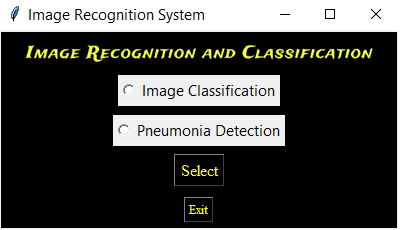

# Image Recognition and Classification
## Overview
This project focuses on image recognition and classification using Convolutional Neural Networks (CNN). It includes two main functionalities: image classification of objects and pneumonia detection. The project provides a user-friendly graphical interface built with Tkinter for easy interaction with the models.



## Features
-> Image classification of objects.<br>
-> Pneumonia detection.<br>
-> Graphical user interface (GUI) for seamless interaction.<br>
-> Models built using TensorFlow and Keras.

## Installation
1. Download the project repository from GitHub or Google Drive.
2. Clone the repository to your local machine:
```bash
git clone https://github.com/your_username/your_repository.git
```
3. Install the required dependencies:   
```bash
pip install -r requirements.txt
```
4. Download the pre-trained models and place them in the appropriate directories:
- `image_classifier_model.keras` in `./notebooks/models/`
- `pneumonia_detection_model.keras` in `./notebooks/models/`

## Usage
1. Run the main.py file to launch the GUI:
```bash
python app.py
```
2. Choose between image classification or pneumonia detection by selecting the respective option from the GUI.
3. Upload an image for classification or pneumonia detection using the provided buttons.
### Image Classification

### Pneumonia Detection


4. View the predicted results displayed on the GUI.

## Note
- Make sure to provide valid image files for accurate predictions.
- For any issues or inquiries, please contact [durgaprasadbokka@gmail.com].
## Credits
- This project utilizes the following libraries:
- Tkinter for GUI development.
- PIL for image processing.
- NumPy for numerical operations.
- TensorFlow and Keras for deep learning tasks.

